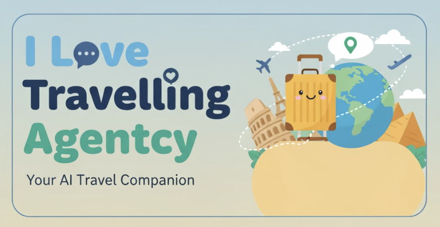

This project is an intelligent, one-stop travel agent that empowers the employees of "I Love Travel Agentcy" to craft perfect, weather-appropriate vacation plans for any city, for the very next day.

---

## 🎯 The Problem

Planning last-minute trips is stressful. Travel agents often struggle to find activities that are not only exciting but also suitable for the next day's weather. This can lead to disappointed customers and a lot of manual, time-consuming research.

## ✨ Our Solution

Traditionally, planning a custom vacation itinerary required a whole team: a researcher to find attractions, a creative to design marketing materials, and an accountant to handle billing. This process was slow, expensive, and required significant manual effort.

Our solution is a single, powerful AI agent that automates the entire workflow. It acts as a digital "super-employee," performing the roles of an entire team to deliver perfect, weather-aware vacation plans in seconds. This frees up human agents to focus on what they do best: building relationships with clients.

## 🚀 How It Works

Our AI agent follows a seamless, automated flow, just like a highly efficient project manager:

1.  **📍 Get Destination:** The agent asks for the target city for the vacation plan.
2.  **🌦️ Analyze Weather:** It calls a weather API to get the forecast for the next day, analyzing temperature, conditions (sunny, rainy, etc.), and wind speed to determine the best type of activities.
3.  **🔍 Find Activities:** Using Google Search, the agent finds the best local attractions and activities that perfectly match the weather conditions.
4.  **🎨 Generate Advertisement:** The recommended activities are passed to an image generator, which creates a beautiful, "award-winning" advertisement to entice travelers.
5.  **💰 Create Payment Link:** Finally, the agent uses the Tikkie API to generate a payment link, making it effortless for the agency to collect payments from clients.

## 🤖 Meet the AI Team

Our agent isn't just one tool; it's a coordinated team of digital specialists, each with a crucial role that replaces a traditional employee's function:

*   **The Researcher (Google Search):** Our diligent researcher scours the internet in real-time to find the best local attractions, hidden gems, and exciting activities, ensuring every recommendation is top-notch.

*   **The Meteorologist (Weather API):** This expert provides up-to-the-minute weather forecasts, analyzing conditions to guarantee that every suggested activity is perfectly suited for the day ahead. No more rained-out picnics!

*   **The Creative Director (`nano-banana`):** Once the plan is set, our in-house designer takes over, generating beautiful, "award-winning" advertisements to capture travelers' imaginations and drive bookings.

*   **The Accountant (Tikkie API):** Efficient and reliable, the accountant handles all the finances, instantly creating payment links to streamline the billing process for both the agency and the customer.

## 🖥️ Custom UI

And where does this team work? We developed a sleek and intuitive front-end using **Streamlit** to serve as their digital office. It includes a simple login system that personalizes the agent's interactions, creating an engaging and collaborative workspace for the human travel agent.

## 🏆 Example Outputs

Check out some sample interactions and the beautiful outputs generated by our AI for various destinations!

| City      | Generated Sample Plan & Ad                               |
| :-------- | :------------------------------------------------ |
| Amsterdam | [View PDF](./samples/amsterdam.pdf)               |
| Athens    | [View PDF](./samples/athens.pdf)                  |
| Dubai     | [View PDF](./samples/dubai.pdf)                   |
| Japan     | [View PDF](./samples/japan.pdf)                   |
| Paris     | [View PDF](./samples/paris.pdf)                   |

---

## 🏃 How to Run

To get the project up and running, follow these steps:

**Install dependencies:**
```bash
pip install -r requirements.txt
```

**Run the agent (root of the folder):**
```bash
adk api_server
```

**Run the Streamlit app (inside chat_ui folder):**
```bash
streamlit run app.py
```
